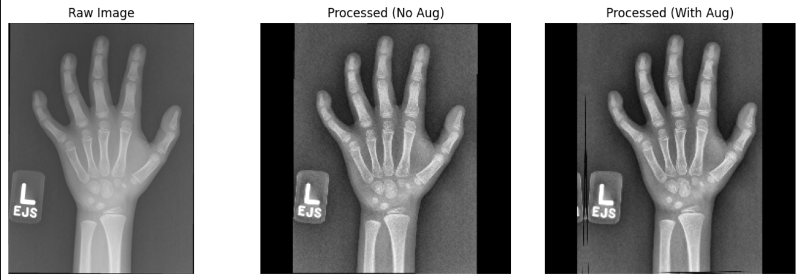
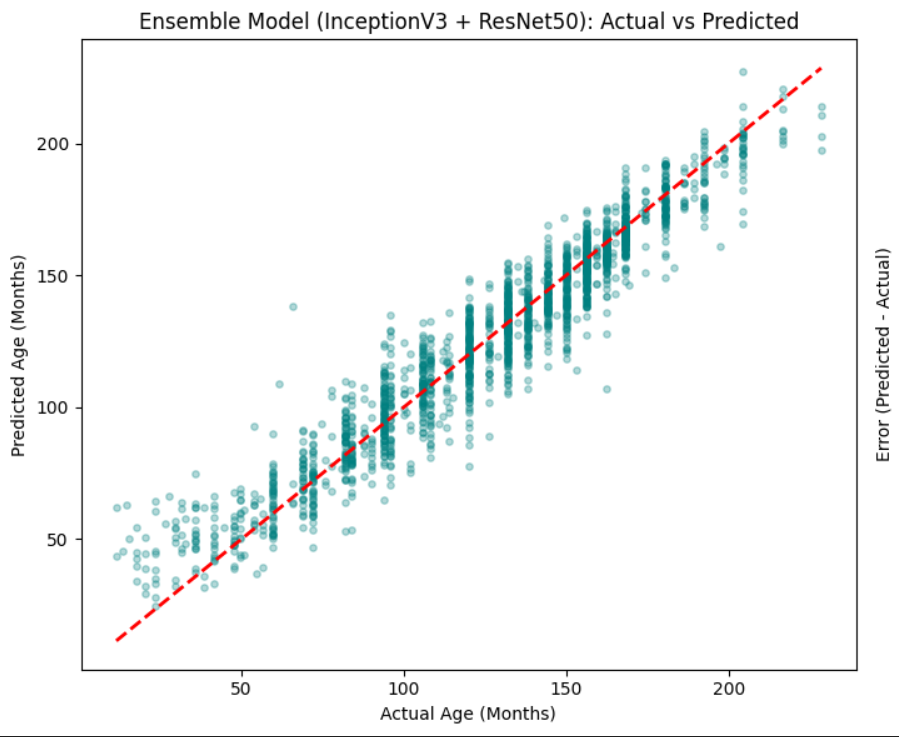
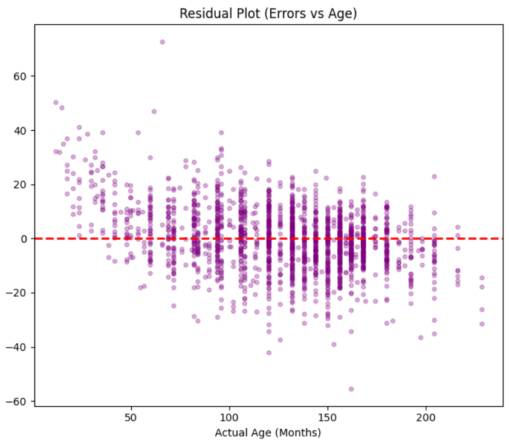

# 🦴 Age Prediction from Hand X-ray Images
## Project Overview

A deep learning-based medical imaging project for **bone age assessment** using pediatric hand X-ray images and demographic metadata.
The system predicts skeletal age in **months** through a multimodal ensemble CNN architecture combining visual features and gender information trained on the **RSNA 2017 Bone Age Dataset**.

# Screenshots

## Preprocessing Pipeline

```md

```

## Scatter Plot Results

```md

```

## Residual Plot

```md

```

# System Pipeline

## 1. Image Preprocessing

### Grayscale Loading

All X-rays are loaded in single-channel grayscale mode to focus on tissue density and reduce unnecessary noise.

### CLAHE Enhancement

Contrast Limited Adaptive Histogram Equalization (CLAHE) improves local contrast and highlights important bone growth regions.

### Data Augmentation

* Random rotation
* Random translation
* Brightness adjustment
* Contrast scaling

### Letterbox Resizing

Preserves anatomical proportions without distorting bone geometry.

### Pixel Normalization

Pixel values normalized from `[0,255] → [0,1]`.

### Channel Expansion

Grayscale images are converted into pseudo-RGB format for compatibility with pretrained CNNs.


# Model Architecture

The system uses a **multimodal ensemble CNN architecture** composed of:

## InceptionV3 Backbone

* Pretrained on ImageNet
* Fully fine-tuned
* Extracts multi-scale spatial features

## ResNet50 Backbone

* Pretrained on ImageNet
* Extracts deep residual features

## Feature Fusion

Outputs from both networks are concatenated into a unified visual feature vector.

## Gender Embedding Branch

A learnable embedding layer processes gender information to capture gender-specific growth patterns.

## Regression Head

Fully connected layers predict normalized bone age values.


# Results

| Metric                  | Value        |
| ----------------------- | ------------ |
| MAE                     | 8.7 Months   |
| RMSE                    | 11.53 Months |
| R² Score                | 0.9217       |
| Accuracy Within 1 Year  | 74.95%       |
| Accuracy Within 2 Years | 95.45%       |


#  Dataset

* **RSNA 2017 Pediatric Bone Age Dataset**

```md
[RSNA Dataset](https://www.kaggle.com/datasets/kmader/rsna-bone-age?select=boneage-training-dataset.csv)
```

# 🛠 Technologies Used

* TensorFlow / Keras
* Python
* OpenCV
* Scikit-learn

# Contributors <a name = "Contributors"></a>
<table>
  <tr>
    <td align="center">
    <a href="https://github.com/aliyounis33" target="_black">
    
    <br />
    <sub><b>Ali Younis</b></sub></a>
    </td>
    <td align="center">
    <a href="https://github.com/mostafa-aboelmagd" target="_black">
    
    <br />
    <sub><b>Mostafa Ayman</b></sub></a>
    </td>
    <td align="center">
    <a href="https://github.com/PavlyAwad/PavlyAwad" target="_black">
    
    <br />
    <sub><b>Pavly Awad</b></sub></a>
    </td>
    <td align="center">
    <a href="https://github.com/zeyad-amr-22" target="_black">
    
    <br />
    <sub><b>Zeyad Amr</b></sub></a>
    </td>
      </tr>
</table>

